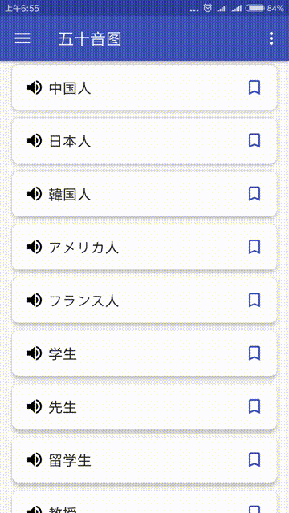
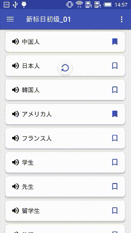
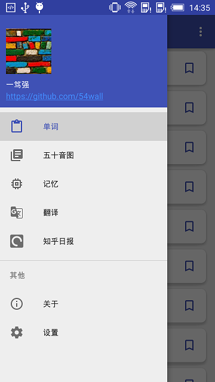
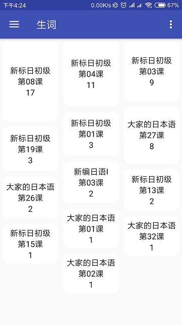
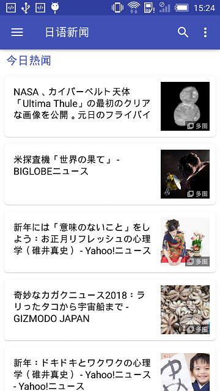

# 鲤鱼日语

鲤鱼日语基于MVP+RxJava2+Retrofit2,一个简单的日语单词记忆App，它包含了新版标准日本语，大家的日本语，新编日语几套常见的日语教材词库，和五十音的入门教学，还有来自[News API](https://newsapi.org/)的日文新闻，适配Android P(28)：

- Material Design
- RxJava2(Not RxJava1.x)
- Retrofit2
- 支持TTS语音（需要联网）
- 下拉开启乱序记忆
- 生词收藏分类到每课
- 五十音图笔画和发声

## 效果图

   
   
 
 

## Forked & Thanks

- [JPStart](https://github.com/pwcong/JPStart)
- [MyTimes](https://github.com/debajyotibasak/MyTimes)
- [Zhihu](https://github.com/yiyibb/Zhihu)

## 第三方库
- [News API](https://newsapi.org/)
- [RxJava](https://github.com/ReactiveX/RxJava)
- [Glide](https://github.com/bumptech/glide)
- [android-jatts](https://github.com/gimite/android-jatts)
- [ButterKnife](https://github.com/JakeWharton/butterknife)
- [Retrofit](https://github.com/square/retrofit)
- [leakcanary](https://github.com/square/leakcanary)
- [PhotoView](https://github.com/chrisbanes/PhotoView)
- [baseAdapter](https://github.com/hongyangAndroid/baseAdapter)
- [material-design-icons](https://github.com/google/material-design-icons)
- [multiline-collapsingtoolbar](https://github.com/opacapp/multiline-collapsingtoolbar)
- [RecyclerViewAnimation](https://github.com/nuptboyzhb/RecyclerViewAnimation)
- [RecyclerView](https://github.com/zhanglongt/RecyclerView)

### 感谢浏览，喜欢请赏star。